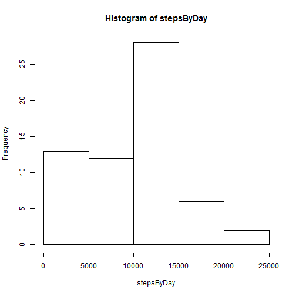
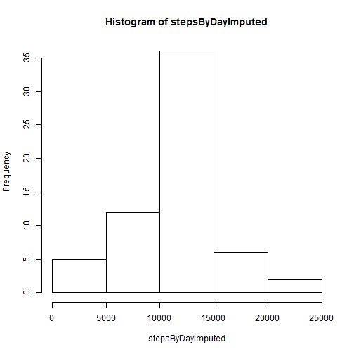
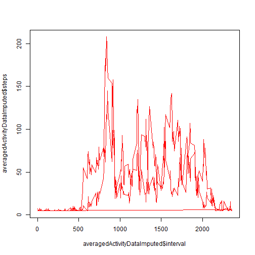
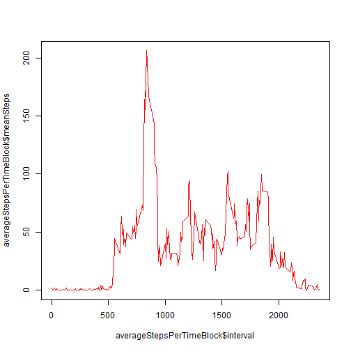

# Reproducible Research: Peer Assessment 1

## Loading and preprocessing the data

### 1. Load the data (i.e. read.csv())


```r
setwd("C:/Users/mmahajan/Desktop/Temp Files/Kag/R")
activityData <- read.csv("C:/Users/mmahajan/Desktop/Temp Files/Kag/R/activity.csv", header=T, sep=",")
```
### 2. What is mean total number of steps taken per day?


```r
stepsByDay <- tapply(activityData$steps, activityData$date, sum, na.rm=TRUE)
```
### 2. Calculate and report the mean and median total number of steps taken per day


```r
hist(stepsByDay,data = stepsByDay)
```

```
## Warning in title(main = main, sub = sub, xlab = xlab, ylab = ylab, ...):
## "data" is not a graphical parameter
```

```
## Warning in axis(1, ...): "data" is not a graphical parameter
```

```
## Warning in axis(2, ...): "data" is not a graphical parameter
```

 

## Imputing missing values


```r
numMissingValues <- length(which(is.na(activityData$steps)))

numMissingValues
```

```
## [1] 2304
```

```r
activityDataImputed <- activityData
library(Hmisc)
```

```
## Warning: package 'Hmisc' was built under R version 3.1.3
```

```
## Loading required package: lattice
## Loading required package: survival
## Loading required package: splines
## Loading required package: Formula
```

```
## Warning: package 'Formula' was built under R version 3.1.3
```

```
## Loading required package: ggplot2
```

```
## Warning: package 'ggplot2' was built under R version 3.1.3
```

```
## 
## Attaching package: 'Hmisc'
## 
## The following objects are masked from 'package:base':
## 
##     format.pval, round.POSIXt, trunc.POSIXt, units
```

```r
activityDataImputed$steps <- impute(activityData$steps, fun=mean)
stepsByDayImputed <- tapply(activityDataImputed$steps, activityDataImputed$date, sum)


hist(stepsByDayImputed,data = stepsByDayImputed)
```

```
## Warning in title(main = main, sub = sub, xlab = xlab, ylab = ylab, ...):
## "data" is not a graphical parameter
```

```
## Warning in axis(1, ...): "data" is not a graphical parameter
```

```
## Warning in axis(2, ...): "data" is not a graphical parameter
```

 

```r
stepsByDayMeanImputed <- mean(stepsByDayImputed)
stepsByDayMedianImputed <- median(stepsByDayImputed)

 stepsByDayMeanImputed
```

```
## [1] 10766.19
```

```r
 stepsByDayMedianImputed
```

```
## [1] 10766.19
```

## Are there differences in activity patterns between weekdays and weekends?


```r
activityDataImputed$dateType <-  ifelse(as.POSIXlt(activityDataImputed$date)$wday %in% c(0,6), 'weekend', 'weekday')

averagedActivityDataImputed <- aggregate(steps ~ interval + dateType, data=activityDataImputed, mean)

plot(averagedActivityDataImputed$interval,averagedActivityDataImputed$steps,type='l', col='red')
```

 


### 3. Calculate and report the mean and median total number of steps taken per day

```r
stepsByDayMean <- mean(stepsByDay)
stepsByDayMedian <- median(stepsByDay)
stepsByDayMean
```

```
## [1] 9354.23
```

```r
stepsByDayMedian
```

```
## [1] 10395
```


## What is the average daily activity pattern?


```r
averageStepsPerTimeBlock <- aggregate(x=list(meanSteps=activityData$steps), by=list(interval=activityData$interval), FUN=mean, na.rm=TRUE)


plot(averageStepsPerTimeBlock$interval,averageStepsPerTimeBlock$meanSteps,type='l', col='red')
```

 

```r
mostSteps <- which.max(averageStepsPerTimeBlock$meanSteps)
timeMostSteps <-  gsub("([0-9]{1,2})([0-9]{2})", "\\1:\\2", averageStepsPerTimeBlock[mostSteps,'interval'])

timeMostSteps  
```

```
## [1] "8:35"
```

## Imputing missing values


```r
numMissingValues <- length(which(is.na(activityData$steps)))

numMissingValues
```

```
## [1] 2304
```

```r
activityDataImputed <- activityData
library(Hmisc)
activityDataImputed$steps <- impute(activityData$steps, fun=mean)
stepsByDayImputed <- tapply(activityDataImputed$steps, activityDataImputed$date, sum)

hist(stepsByDayImputed,data = stepsByDayImputed)
```

```
## Warning in title(main = main, sub = sub, xlab = xlab, ylab = ylab, ...):
## "data" is not a graphical parameter
```

```
## Warning in axis(1, ...): "data" is not a graphical parameter
```

```
## Warning in axis(2, ...): "data" is not a graphical parameter
```

 

```r
stepsByDayMeanImputed <- mean(stepsByDayImputed)
stepsByDayMedianImputed <- median(stepsByDayImputed)

stepsByDayMeanImputed
```

```
## [1] 10766.19
```

```r
stepsByDayMedianImputed
```

```
## [1] 10766.19
```

## Are there differences in activity patterns between weekdays and weekends?


```r
activityDataImputed$dateType <-  ifelse(as.POSIXlt(activityDataImputed$date)$wday %in% c(0,6), 'weekend', 'weekday')

averagedActivityDataImputed <- aggregate(steps ~ interval + dateType, data=activityDataImputed, mean)

plot(averagedActivityDataImputed$interval,averagedActivityDataImputed$steps,type='l', col='red')
```

 


